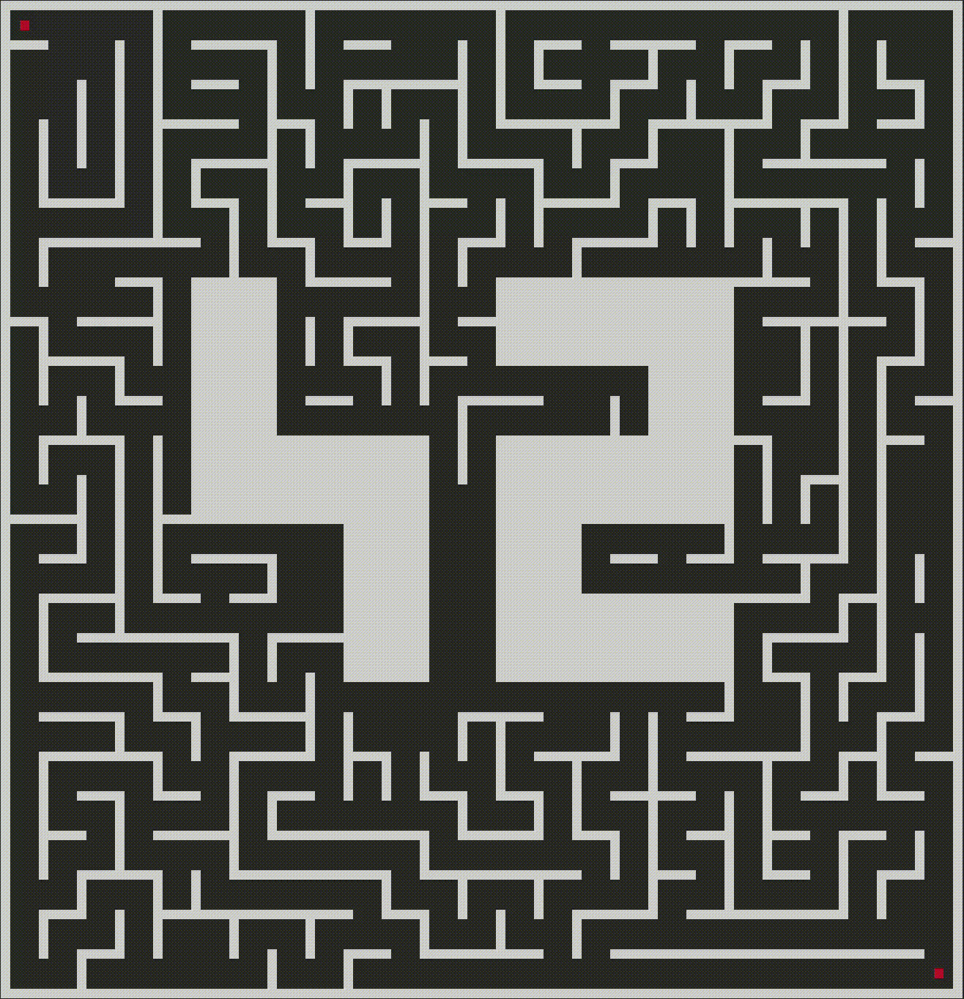

*This project has been created as part of the 42 curriculum by anfarenc, chehir*

# Description
A-Maze-ing is all about, you guessed it, maze generation. In this project, we learn how to create
mazes, the different ways to display them, and how to use them for different purposes such as
pathfinding, or optionally game loops.

While we were given a good amount of freedom, the project must still meet some core requirements:
- Parse a config file and convert the data to usable values
- Generate a valid maze based on these values
- Save the maze to a file in a hexadecimal encoded format
- Provide a visual representation of the maze
- Organise everything into a re-usable module

In addition to the mandatory part, we also implemented a few bonus features, which I will not
reveal yet in order to create a feeling of suspense.



## Table of Contents
- [Description](#description)
- [Instructions](#instructions)
  - [Make Install](#make-install)
  - [Make Lint](#make-lint)
  - [Make Run](#make-run)
  - [Make Clean](#make-clean)
- [Project Overview](#project-overview)
  - [Project File Organization](#project-file-organization)
  - [Maze Configuration File](#maze-configuration-file)
  - [Maze Generation Algorithm](#maze-generation-algorithm)
  - [Pathfinding](#pathfinding)
  - [Bonus Features](#bonus-features)
  - [Project Management](#project-management)
- [Re-usability](#re-usability)
  - [Package Installation](#package-installation)
  - [Manual](#manual)
  - [Mazegen for dummies](#mazegen-for-dummies)
    - [Config dictionary](#config-dictionary)
    - [Mazes](#mazes)
    - [Cells](#cells)
    - [Pathfinder](#pathfinder)
- [Resources](#resources)


# Instructions
In this section we will be explaining how to run our program. The instructions on how to use it for
your own project will be in the [Re-usability](#re-usability) section below.

### Make Install
The first step is to make sure you are in the root folder of the project. Once there, you can run
the command "make install". This will set up a virtual environment with all the dependencies
installed.

```console
 $ make install
Initializing project environment:
Creating virtual environment...
Virtual environment setup complete

Installing dependencies...
All dependencies successfully installed

Project can now be run safely!
```

If an error occurs, it is likely because you ran out of space on your machine, or because your
computer does not have the correct version of Python installed (42 students know).

### Make Lint
Now that the venv is set up, you can run "make lint" to verify the source code. More specifically,
this target will run two linters: Flake8, and Mypy. Flake8 makes sure the code is formatted
properly and has correct syntax, while Mypy is a type checker that verifies the type hints are
consistent.

```console
 $ make lint
Verifying project source code:
Running flake8...
No norm errors found

Running mypy...
No typing errors found

Success: no errors found in source code!
```

Hopefully no errors occur here as that would mean there are mistakes in the final version of our
project... Fingers crossed.


### Make Run
Once that's done, we can get onto the fun part: running the program! To do this, simply run the
command "make run" and follow the instructions within the program. You'll be able to use it to
create new mazes, show the shortest path from start to end, change the maze colors, as well as a
few surprise features :)

```console
 $ make run
```

### Make Clean
Finally, you can run "make clean" to delete the virtual environment, the caches, the maze.txt file,
and any other redundant files or folders.

```console
 $ make clean
Initiating cleanup operation...
 - Removed directory 'amazing/__pycache__'
 - Removed directory 'venv'
 - Removed directory '.mypy_cache'

Cleanup complete!
```


# Project Overview

## Project File Organization
Below is a representation of the file structure, as well as a brief rundown of what each folder
contains:

```bash
A-Maze-ing
│
├── amazing                   # Source code
│   ├── __init__.py
│   └── ...
├── data
│   ├── config.txt
│   ├── maze.txt              # Created maze data will be stored here
│   └── requirements.txt
├── images
│   └── path_animation.gif
├── package                   # Source for re-usable module
│   ├── dist
│   │   ├── mazegen*.whl
│   │   └── mazegen*.tar.gz
│   ├── mazegen.py
│   └── pyproject.toml
├── .flake8
├── .gitignore
├── Makefile
├── mazegen*.whl              # Installable package
└── README.md                 # It's me! 👋
```

#### Notes
- amazing: Folder containing all of the source code.
- data: Folder that holds the config and requirements files. The maze.txt file containing the
        created maze information will also be created here.
- package: This folder contains the re-usable source code for the installable package, as well as a
           .toml file to configure the build.
  - dist: This is the folder created after running **make build**. The installable package is then
          copied to the root, but the files can still be found here if needed.
- images: Contains a single gif, used in **Description** section of this very README
- .flake8: File containing two lines to exclude the venv/ folder from the flake8 formatting check.
           Without this, flake8 sometimes enters the venv folder code while performing its tests.


## Maze Configuration File
The following is an example of a valid config file for our project:

```bash
# Maze configuration data


# Maze size variables
WIDTH=5
HEIGHT=5

# Start and End coordinates
ENTRY=0,0
EXIT=4,4

# Output file name
OUTPUT_FILE=data/maze.txt


# If PERFECT is true, there must only be one valid start->end path
PERFECT=False

# Seed for maze generation
SEED=0

# Maze display colors
WALLS=WHITE
OBJECTIVES=RED
PATH=BLUE
```

All of these keys are mandatory. If any of them are missing, or have incorrect values, the program
will not run.

Possible values for each key:
- **WIDTH & HEIGHT**: Any integer larger than 1. Note that if the maze is too large, the maze
                  generation function may hit the recursion limit. However, this case is managed
                  by Exception handling and will not result in a crash
- **ENTRY & EXIT**: An x and y coordinate, separated by a comma. The coordinates must be within the
                    WIDTH and HEIGHT values
- **OUTPUT_FILE**: A file name ending in ".txt"
- **PERFECT**: A boolean (True or False)
- **SEED**: Any integer. If the seed is 0, a random seed will be generated instead
- **WALLS, OBJECTIVES & PATH**: Any color as long as it's White, Red, Green, Blue, Yellow, or
                                Purple


## Maze Generation Algorithm
For the maze, we start from a two-dimensional grid of cells.
For the generation, we used the **Depth-First Search** (**DFS**) algorithm.

We chose this algorithm because it is simple and efficient, and works well with the project
requirements. The principle is to explore each cell by randomly choosing one of its neighboring
cells that has not been visited yet. If all neighboring cells have already been visited, the
algorithm goes back to the previous cell (backtracking) and repeats the process. This continues
until all cells in the grid have been visited.

This technique guarantees the generation of a perfect maze, meaning that there is only one unique
path between any two cells. To generate an imperfect maze, we randomly remove some walls while
respecting certain rules, such as avoiding corridors wider than two cells.

It was also required to integrate a **42** pattern in the center of the maze. To achieve this, we
first retrieve the maze size and scale the pattern so that it occupies approximately one third of
the maze. The cells representing the symbol are then marked as **full**, meaning they keep all
their walls and are excluded from the maze generation process.


## Pathfinding
For pathfinding, several algorithms were possible, but we decided to go with **A*** (A-Star).

One of the advantages of this algorithm compared to others, such as **DFS** or **BFS**, is that it is
much more efficient. While the previously mentioned algorithms may explore a large number of cells
to find the shortest path, **A*** uses a cost function combined with a heuristic to prioritize the
exploration of the most promising neighboring cells.

Starting from the initial position, the algorithm selects the neighbor with the lowest estimated
total cost and repeats this process until the destination is reached.


## Bonus Features
And now, the moment you've all been waiting for: the bonus features!
- The ability to modify the maze configuration within the user interface
- Multiple display options for the generated maze
- Pathfinding animation that shows the path being created
- Random seed generation if no seed is provided. Users can display this seed, as well as the maze's
  data, in the user interface
- A fun minigame :D

Each of these provided a unique and fun challenge to solve, and greatly improved the final
product.


## Project Management
Coming up with a decent blueprint and equally dividing the work between teammates is one of the
most important steps in any project, and because good management is an essential skill in the
workplace, we wanted to make sure we succeeded in this area.

### Team Roles
Behold, a good old table to demonstrate task distribution:

|           anfarenc           |            chehir            |         Mutual Tasks         |
|:-----------------------------|:-----------------------------|:-----------------------------|
| Cell class implementation    | Configuration parsing        | Bug fixes                    |
| Maze class implementation    | User interface loop          | Code refactoring             |
| Maze generation algorithm    | Maze rendering               | README additions             |
| Pathfinding algorithm        | Bonus features (4/5)         | Re-usable packaging          |
| Bonus features (1/5)         | Makefile                     |                              |


### Roadmap
While the equal division of the workload did go great, we admittedly could have done a better job
at plotting the course of our amazing ***A-Maze-ing*** journey, because the initial timeline we
came up with went something like this:

**Parsing -> Maze Generation -> Maze rendering -> ??? -> Final result**

This, rather self-evidently, is a very lackluster roadmap, and the "**???**" section ended up being
much more time-consuming than we anticipated. The lack of a proper plan also resulted in a few
*"What do I do now?"* and *"I didn't realise we had to do this"* moments.
Some actual examples of this include:
- Having to add color keys to the config file halfway through the project, which involved having
  to update all the parsing code.
- When we decided to have multiple maze formats for the terminal display, which meant adding a
  'style' parameter to the already established display functions.
- Adding the 42 symbol generation ***after*** having already implemented the maze creation algorithm.
- Playing Smash Ultimate instead of working because we didn't know what to do next.

Luckily, because we wrote the code to be easily maintainable and re-usable, this was not too big a
problem, but on a larger project with more people involved it just wouldn't have cut it. It was a
good learning experience, and we now know how to improve for future projects.

Summarized timeline:
1.  Parser
2.  Maze template implementation
3.  Output file creation
4.  User interface
5.  Proper maze generation algorithm
6.  Center 42 symbol addition
7.  Pathfinding algorithm
8.  Started README
9.  Makefile
10. Lots of refactoring
11. Re-usable module
12. Finished README


### Progression
While putting together the pieces of this project, we were both surprised at how well it went.
There were no issues implementing one person's code into the other's, and we were both able to
accomplish our share of the work. Communication played an important role in this: we made sure to
consult the other person on how best to accomplish each task, and reached a consensus before doing
anything. Since our schedules weren't always in-sync, we also made sure to summarize what we worked
on so that the other person would not be lost in the new version.

This meant that we were both happy with the final result and understand how the entire thing works
and fits together, even if we each handled our respective parts separately. We also made sure the
code was easily re-usable, which made complex features easier to implement as we could build on top
of an already solid foundation.

As mentioned previously, the roadmap could, and should have had more effort put into it, but
despite that, the project turned out well.


### Tools
Aside from what was mandatory, no additional tools were used for this project. It runs on the
default Linux terminal using only Python's standard library.


# Re-usability

## Package Installation
The installable package intended to be re-used should be located at the root of the repository
under the name "**mazegen-1.0.0-py3-none-any.whl**", but can also be re-generated if needed. To do
so, simply make sure you have already used the "**make install**" command, then run
"**make build**". This will generate the package/dist folder containing the .whl file and tar.gz
archive, as well as a copy of the .whl at the root.

```console
 $ make build
Building installable package...
Package built successfully!
```

Once you have obtained the .whl file, you can install it using
"**pip install mazegen-1.0.0-py3-none-any.whl**" and import it in your project!

```console
 $ pip install mazegen-1.0.0-py3-none-any.whl
```


## Manual
A guide explaining how to use the module to generate a maze is available, and can be displayed
either on the command line using **python3 -m pydoc mazegen**, or by using the help() function
inside your program:

Command line:
```console
 $ python3 -m pydoc mazegen
```

Python script:
```py
import mazegen


help(mazegen)
```

The manual contains all the generic information, but if you need an in-depth explanation, don't
worry, we've got you covered!


## Mazegen for dummies
Generally speaking, the ***mazegen*** module allows the user to generate mazes... shocking, I know,
but stay with me. To do this, the only prerequisite is a config dictionary with the following keys:

### Config Dictionary
- **WIDTH & HEIGHT**: Any integer larger than 1. Note that if the maze is too large, the maze
                  generation function may hit the recursion limit. However, this case is managed
                  by Exception handling and will not result in a crash
- **ENTRY & EXIT**: A tuple containing an x and y value. Both values must be integers contained
                    within the maze dimensions.
- **PERFECT**: A boolean (True or False)
- **SEED**: Any integer. If the seed is 0, a random seed will be generated instead

```py
# config example
config = {"WIDTH": 10,
          "HEIGHT": 10,
          "ENTRY": (0, 0),
          "EXIT": (9, 9),
          "PERFECT": True,
          "SEED": 42}
```


### Mazes
Now that you've got your dream maze configuration, simply use the **create_instance()** class method
to create a MazeGenerator:

```py
from mazegen import MazeGenerator

config = {"WIDTH": 25,
          "HEIGHT": 25,
          "ENTRY": (0, 0),
          "EXIT": (15, 15),
          "PERFECT": False,
          "SEED": 0}

generator = MazeGenerator.create_instance(config)
```

**MazeGenerators** contain two important things: a maze, and a seed. If you set a specific seed
using the config file, the generator will use that value for its seed, but if you left it as 0,
then the seed will be random. Both of these values have getters and can thus be accessed easily:

```py
from mazegen import MazeGenerator

config = {"WIDTH": 25,
          "HEIGHT": 25,
          "ENTRY": (0, 0),
          "EXIT": (15, 15),
          "PERFECT": False,
          "SEED": 0}

generator = MazeGenerator.create_instance(config)

my_maze = generator.maze
my_seed = generator.seed
```

And that's it! You now have a fully generated maze, along with its seed in case you want to
re-generate the same one later. However, if you do not need the seed and simply want the maze
itself, you can use the **create_new_maze()** function instead to save lines:

```py
from mazegen import create_new_maze

config = {"WIDTH": 25,
          "HEIGHT": 25,
          "ENTRY": (0, 0),
          "EXIT": (15, 15),
          "PERFECT": False,
          "SEED": 0}

my_maze = create_new_maze(config)
```

Mazes have a few useful methods. First of all, you can use **get_hex_data()** to obtain the
hexadecimal value of each maze cell:

```py
from mazegen import create_new_maze

config = {"WIDTH": 15,
          "HEIGHT": 10,
          "ENTRY": (0, 0),
          "EXIT": (14, 9),
          "PERFECT": False,
          "SEED": 0}

my_maze = create_new_maze(config)
data = my_maze.get_hex_data()

print(data)
```

Example output:

```console
B913D1113913913
C46852C2C46A86A
953AFC16FFF82BA
ABAAFD4157F802A
8042FFFAFFFAAEA
AA9453FAFD50292
AAE916FAFFFAAAA
AC5069545112E82
83929291386A906
EC444446C454447
```

You can also remove a wall between two adjacent maze cells using **add_connection()**, which takes
two tuples containing the x and y coordinates of each cell.

```py
my_maze = create_new_maze(config)

x1 = 1
y1 = 1
cell1 = (x1, y1)

x2 = 2
y2 = 1
cell2 = (x2, y2)

my_maze.add_connection(cell1, cell2)
```

Lastly, mazes contain their entry and exit cells, as well as their own height and width:

```py
my_maze = create_new_maze(config)

height = my_maze.height
width = my_maze.width
start = my_maze.start
end = my_maze.end
```


### Cells
The generated mazes are comprised of Cells, which each contain various useful information. We
implemented the __getitem__() and __iter__() magic methods into the maze class, so accessing a
given cell is easy:

```py
my_maze = create_new_maze(config)

line = 0
column = 0
my_cell = my_maze[line][column]
```

To check which walls are present in a given cell, you can use the **get_walls()** method. As the
name implies, this will return a list of the cell's walls. You can also get a cell's coordinates
using the **coordinates** getter.

```py
line = 0
column = 0
my_cell = my_maze[line][column]

walls = my_cell.get_walls()

coords = my_cell.coordinates

print(walls)
print(coords)
```

Example output:

```console
['North', 'East', 'West']
(0, 0)
```


### Pathfinder
The Pathfinder class allows us to find the shortest path between two cells in the maze. It is
initialized using a maze, and its start and end points are set to the maze's entry and exit cells
by default. You can obtain the start->end directions in list format with **get_directions()**,
or in string format, using **get_direction_string()**.

```py
from mazegen import create_new_maze, Pathfinder

config = {"WIDTH": 15,
          "HEIGHT": 10,
          "ENTRY": (0, 0),
          "EXIT": (5, 5),
          "PERFECT": False,
          "SEED": 0}

my_maze = create_new_maze(config)

pathfinder = Pathfinder(my_maze)

direction_list = pathfinder.get_directions()
directions = pathfinder.get_direction_string()

print(direction_list)
print(directions)
```

Example output:

```console
EESSESSWSSENEE
['E', 'E', 'S', 'S', 'E', 'S', 'S', 'W', 'S', 'S', 'E', 'N', 'E', 'E']
```

The start and end points can be modified easily using the in-built setters:

```py
my_maze = create_new_maze(config)

pathfinder = Pathfinder(my_maze)
pathfinder.start = my_maze[0][0]
pathfinder.end = my_maze[1][0]

directions = pathfinder.get_direction_string()
print(directions)
```

Example output:

```console
S
```

And that should be everything! We hope our module is useful and easy to figure out. Good luck with
Pacman!


# Resources

## Research
Below is a list of as many websites, articles, videos, or blogs we found during our research:

[ANSI escape code list](https://gist.github.com/fnky/458719343aabd01cfb17a3a4f7296797)

[Seeded random explanation](https://www.w3schools.com/python/ref_random_seed.asp)

[Creating a Python package](https://packaging.python.org/en/latest/tutorials/packaging-projects/)

[Readme tutorial](https://www.makeareadme.com/)

[Markdown file structure example](https://stackoverflow.com/questions/19699059/print-directory-file-structure-with-icons-for-representation-in-markdown)

[Maze Algorithm generation](https://en.wikipedia.org/wiki/Maze_generation_algorithm)

[DFS Algorithm](https://youtu.be/HyK_Q5rrcr4?si=9pzVmxK7Vll3XEzA)

[A* Algorithm Wikipedia](https://en.wikipedia.org/wiki/A*_search_algorithm)

[A* Algorithm geeksforgeeks](https://www.geeksforgeeks.org/dsa/a-search-algorithm/)


## AI
While AI was used in order to avoid spending too much time on the boring parts, we wanted to avoid
relying on it as much as possible; partly for pride-related reasons, but mostly because figuring
things out yourself is a better way of learning.

Examples of things we used AI for include:
- Debugging
- Algorithm explanations
- Researching specific information:
  - Relevant Unicode symbols
  - Useful libraries
  - Bash commands for Makefile
  - Markdown formatting tips
- Spelling corrections
